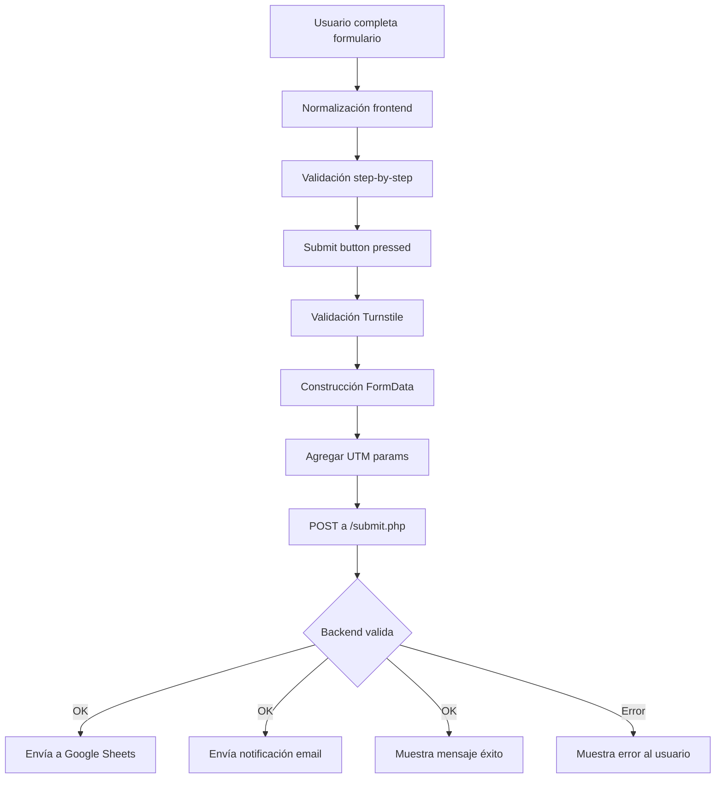

# Sincronización Frontend-Backend

## Resumen

Este documento detalla cómo el formulario de la landing page se sincroniza con el backend (`submit.php`).

---

## Campos del Formulario → Backend

### 1. Campos de entrada del usuario (Step 1)

| Campo Frontend | ID/Name HTML | Campo Backend | Tipo | Normalización |
|----------------|--------------|---------------|------|---------------|
| Nombre completo | `#nombre` | `nombre` | text | Capitalización (Primera letra mayúscula) |
| RUT | `#rut` | `rut` | text | Formato: `12.345.678-9` |
| Teléfono WhatsApp | `#telefono` | `whatsapp` | tel | Formato: `+56 9 xxxx xxxx` |
| Correo electrónico | `#correo` | `email` | email | Lowercase, trimmed |

### 2. Campos de perfil financiero (Step 2)

| Campo Frontend | Name HTML | Campo Backend | Valores |
|----------------|-----------|---------------|---------|
| Objetivo | `name="objetivo"` | `objetivo` | `invertir`, `vivir`, `no-se` |
| Renta líquida | `name="renta-rango"` | `renta_liquida` | Mapeado a valores numéricos |
| Capacidad de ahorro | `name="ahorro-mensual"` | `capacidad_ahorro_mensual` | Mapeado a valores numéricos |
| Tipo de propiedad | `name="tipo"` | `comentarios` | Incluido como texto en comentarios |

#### Mapeo de Renta Líquida:

```javascript
'1000001-1400000' → '1200000'
'1400001-1800000' → '1600000'
'1800001+' → '2000000'
```

#### Mapeo de Capacidad de Ahorro:

```javascript
'0' → tiene_ahorro: 'no', capacidad_ahorro_mensual: '0'
'100000-200000' → tiene_ahorro: 'si', capacidad_ahorro_mensual: '150000'
'200001-400000' → tiene_ahorro: 'si', capacidad_ahorro_mensual: '300000'
'400001+' → tiene_ahorro: 'si', capacidad_ahorro_mensual: '500000'
```

### 3. Campos hardcoded (no visibles en el form)

| Campo Backend | Valor | Descripción |
|---------------|-------|-------------|
| `tipo_ingreso` | `'dependiente'` | Tipo de ingreso por defecto |
| `tipo_contrato` | `''` | Campo opcional, no usado |
| `tipo_ingreso_independiente` | `''` | Campo opcional, no usado |
| `comunas_interes` | `'Santiago Centro'` | Ubicación del proyecto |
| `canal_preferido` | `'whatsapp'` | Eliminado del form, valor por defecto |
| `franja_preferida` | `'flexible'` | No incluido en el form |

### 4. Campos de consentimiento

| Campo Frontend | ID HTML | Campo Backend | Valores |
|----------------|---------|---------------|---------|
| Acepto términos | `#terminos` | `consentimiento_privacidad` | `'si'` / `'no'` |
| Acepto términos | `#terminos` | `consentimiento_contacto` | `'si'` / `'no'` |

### 5. Campos de seguridad y tracking

| Campo | Valor | Descripción |
|-------|-------|-------------|
| `honey` | `''` | Honeypot anti-bot (debe estar vacío) |
| `cf-turnstile-response` | Token | Token de Cloudflare Turnstile |
| `utm_source` | URL param | Parámetro UTM de tracking |
| `utm_medium` | URL param | Parámetro UTM de tracking |
| `utm_campaign` | URL param | Parámetro UTM de tracking |
| `gclid` | URL param | Google Click ID |
| `fbclid` | URL param | Facebook Click ID |
| `ttclid` | URL param | TikTok Click ID |

---

## Validaciones Backend

### Campos Requeridos:
```php
[
  'nombre', 'rut', 'whatsapp', 'email', 'objetivo',
  'tipo_ingreso', 'renta_liquida', 'capacidad_ahorro_mensual',
  'tiene_ahorro', 'comunas_interes', 'canal_preferido',
  'franja_preferida', 'consentimiento_privacidad', 'consentimiento_contacto'
]
```

### Validaciones de Formato:

1. **Email**: 
   - Validación: `FILTER_VALIDATE_EMAIL`
   - Ejemplo válido: `usuario@dominio.com`

2. **WhatsApp**: 
   - Validación regex: `/^(?:\+?56\s?)?9\s?\d{4}\s?\d{4}$/`
   - Formato esperado: `+56 9 xxxx xxxx`
   - Frontend normaliza a este formato automáticamente

3. **tiene_ahorro**:
   - Si es `'si'`, debe incluir `monto_ahorro` > 0
   - Si es `'no'`, `monto_ahorro` se establece en `'0'`

---

## Flujo de Datos



---

## Normalización de Campos

### RUT:
- **Input**: `282244012`
- **Output**: `28.224.401-2`
- Algoritmo: Agregar puntos cada 3 dígitos desde la derecha, extraer dígito verificador

### Teléfono:
- **Input**: `966013182` o `56966013182`
- **Output**: `+56 9 6601 3182`
- Algoritmo: Agregar prefijo `+56 9`, formatear con espacios

### Números (Renta/Ahorro):
- **Input**: `1500000`
- **Output**: `1.500.000`
- Formato chileno con separadores de miles (puntos)

### Email:
- **Input**: `Usuario@Email.COM`
- **Output**: `usuario@email.com`
- Normalización: lowercase, trim

### Nombre:
- **Input**: `juan pérez garcía`
- **Output**: `Juan Pérez García`
- Normalización: Primera letra de cada palabra en mayúscula

---

## Respuesta del Backend

### Éxito:
```json
{
  "ok": true,
  "message": "Registro almacenado.",
  "mail_sent": true,
  "ua_logged": true
}
```

### Error:
```json
{
  "ok": false,
  "message": "Mensaje de error específico"
}
```

---

## Configuración de Entorno

### Variables requeridas en `.env` (producción):
```env
TURNSTILE_SECRET_KEY=xxxxx
SHEETS_WEB_APP_URL=https://script.google.com/macros/s/xxxxx/exec
SHEETS_SHEET_ID=xxxxx
EMAIL_NOTIFY_TO=contacto@selectcapital.cl
EMAIL_FROM_ADDRESS=no-reply@selectcapital.cl
GOOGLE_MAPS_API_KEY=xxxxx
```

### Dominios permitidos:
- `selectcapital.cl`
- `www.selectcapital.cl`
- `dev.selectcapital.cl`

---

## Cambios Recientes (v2.0)

### ✅ Eliminados:
- Campo "preferencia de contacto" (ahora hardcoded a `'whatsapp'`)
- Step 3 del wizard

### ✅ Agregados:
- Pantalla de agradecimiento después del envío
- Captura automática de UTM parameters
- Normalización mejorada de RUT y teléfono con manejo de cursor
- Normalización de números (renta/ahorro) con manejo de cursor

### ✅ Actualizados:
- Wizard reducido de 3 a 2 pasos
- Estilos más compactos para option-buttons
- `config.php` sincronizado con campos requeridos actuales
- Mapeo de tipo de propiedad a comentarios

---

## Testing en Desarrollo

Para probar en modo desarrollo:

1. En `config.php`, cambiar:
   ```php
   'app_env' => 'development',
   ```

2. En desarrollo, el backend:
   - ✅ Omite validación de Turnstile
   - ✅ Omite envío a Google Sheets
   - ✅ Omite envío de emails
   - ✅ Registra payload en logs
   - ✅ Permite cualquier hostname

3. Ver logs en:
   ```
   /logs/app.log
   ```

---

## Mantenimiento

### Agregar un nuevo campo:

1. **Frontend** (`base.html`):
   - Agregar input/select en el HTML
   - Agregar normalización si es necesario
   - Agregar al FormData en el submit handler

2. **Backend** (`config.php`):
   - Agregar a `allowed_fields`
   - Agregar a `required_fields` (si es requerido)

3. **Backend** (`submit.php`):
   - Agregar al payload (líneas 350-378)
   - Agregar validación personalizada si es necesario

4. **Google Sheets**:
   - Agregar columna correspondiente en la hoja
   - Actualizar el Apps Script para recibir el campo

---

## Documentación Adicional

- [FORMULARIO_DOCUMENTACION.md](./FORMULARIO_DOCUMENTACION.md) - Documentación completa del formulario
- [CORRECCIONES_FORMULARIO.md](./CORRECCIONES_FORMULARIO.md) - Historial de correcciones
- [AUDITORIA_QA.md](./AUDITORIA_QA.md) - Resultados de auditoría de QA
- [AUDITORIA_UIUX.md](./AUDITORIA_UIUX.md) - Resultados de auditoría de UI/UX

---

## Contacto de Soporte

Para problemas con el backend, revisar:
1. Logs del servidor: `/logs/app.log`
2. Consola del navegador (errores JS)
3. Network tab (respuestas del servidor)
4. Google Sheets (si los datos llegan)

**Última actualización**: Noviembre 2025

